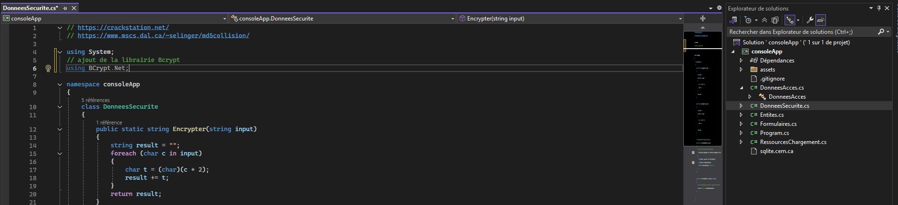
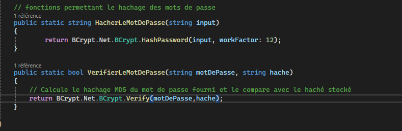
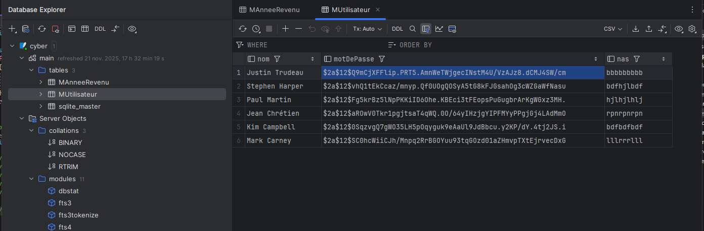

## Début du rapport
# Rapport TP3 de Cybersec Diallo Mamadou Bobo

## Attaque 1: BD fuitée et mot de passe

## Emplacement de la bd (utiliser system informer)

## Ouverture de la bd avec dataGrip

## il ya 3 tables (XML)

## on peut voir les mots de pass (hachs) et les NAS 

### Correctif implanté

On va sécurisé l'apllication avec BCrypt dans visual studio. On ajoute la commande using Bcrypt.Net; pour utiliser la librairie Bcrypt.

 
Dans DonneesSecurite.cs, on modifie le code à l'emplacement fonction permettant le hachage pour cette commande : 

Une fois celà fait, on vérifie le résultat et on constate que les mots de passes dans la base de donnée sont hachés avec Bcrypt.

##
## Attaque 2: BD fuitée et encryption

1. Etape 1 + copie d'écran
2. Etape 2 + copie d'écran
3. etc.

### Correctif implanté

Court descriptif du correctif et lien vers le(s) commit(s).

Preuve que l'attaque ne fonctionne plus avec étapes + copie d'écran

## Attaque 3 Injection SQL

1. Etape 1 + copie d'écran
2. Etape 2 + copie d'écran
3. etc.

### Correctif implanté

Description du correctif.

Preuve que l'attaque ne fonctionne plus avec étapes + copie d'écran
