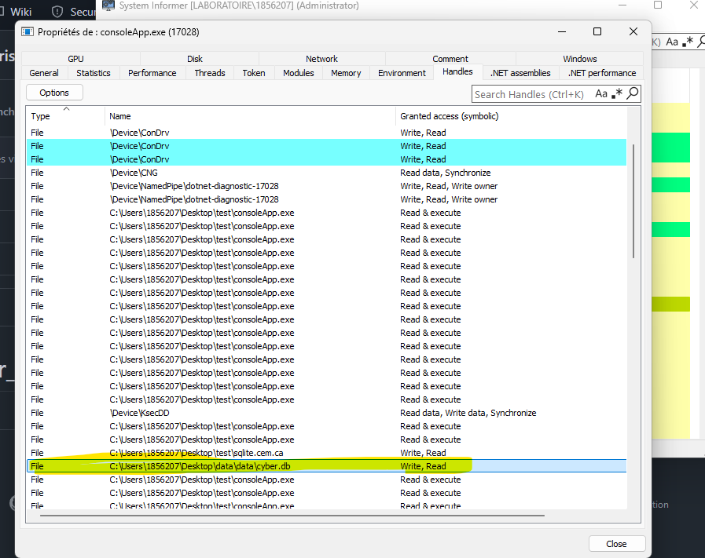
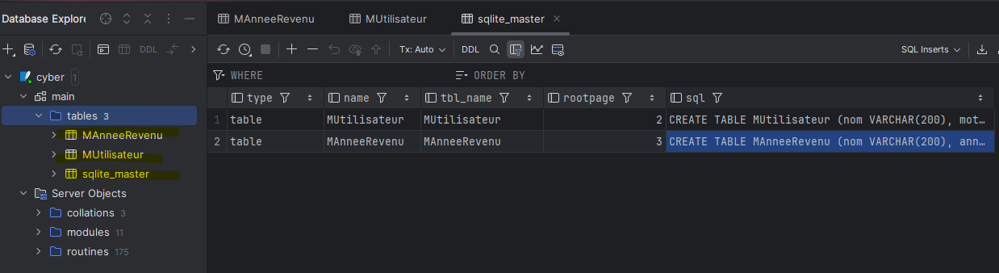

## indice pour le debut la base de donnée (dossier:data) est créer dans  le repertoire parent quand tu deplace l'application. le mdp est haché mais facile a voir. le Nas est encrypté 123456789 = bdfhjlnpr

## emplacement de la bd (utiliser system informer)

## ouverture de la bd avec dataGrip

## la base de donnée est en xml

## il ya 3 tables 

## on peut voir les mots de pass (hachs) et les NAS 

## on peut aussi modifier les données donc les mots de passes et les revenus
