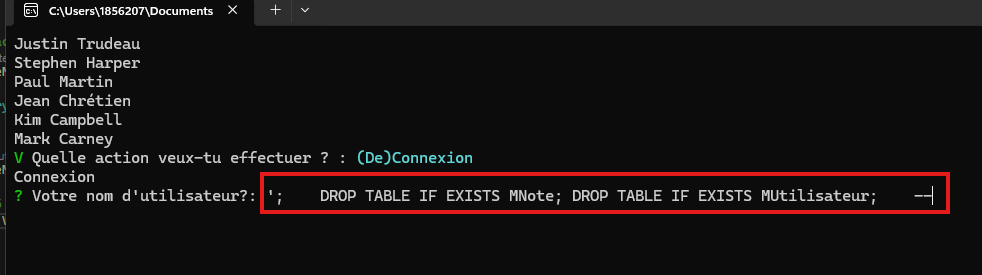
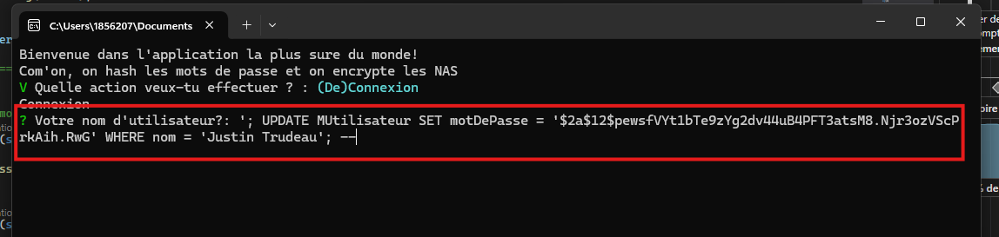
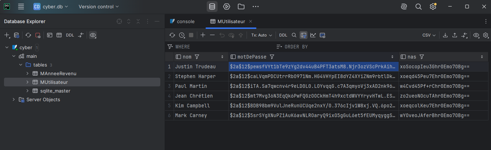
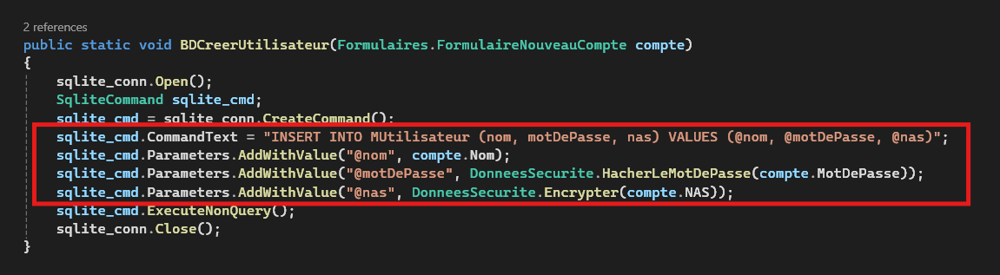
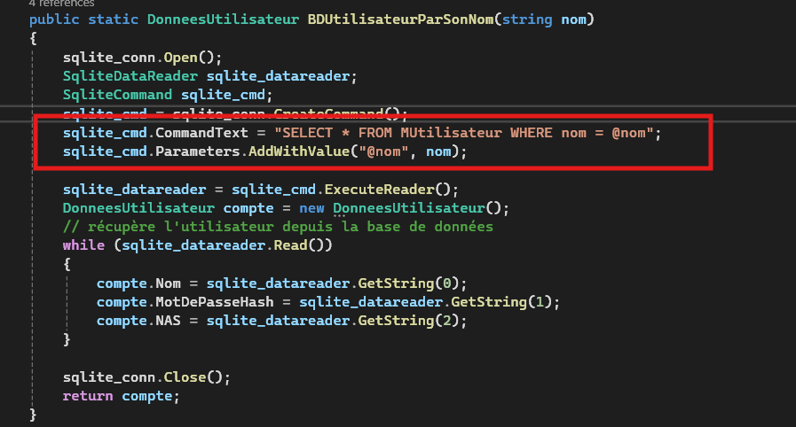
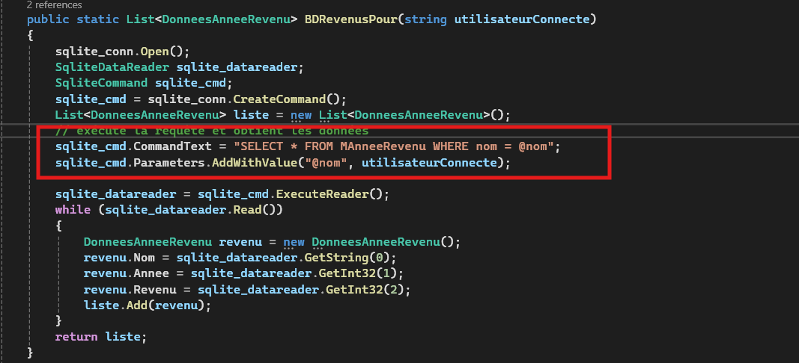

## Début du rapport
# Rapport TP3 de Cybersecurité de Diallo Mamadou Bobo

## Attaque 1: BD fuitée et mot de passe

Emplacement de la BD (utiliser system informer)

 Ouverture de la BD avec DataGrip

 il y a 3 tables (XML)

 on peut voir les mots de passe (hachs) et les NAS 

### Correctif implanté

On va sécuriser l'application avec BCrypt dans Visual Studio. On ajoute la commande using Bcrypt.Net ; pour utiliser la librairie Bcrypt.

 
Dans DonneesSecurite.cs, on modifie le code à l'emplacement fonction permettant le hachage pour cette commande : 

Une fois cela fait, on vérifie le résultat et on constate que les mots de passe dans la base de données sont hachés avec Bcrypt.

## Attaque 2: BD fuitée et encryption

Dans la base de données, les NAS sont chiffrés avec une logique de base qui change chaque lettre de l'alphabet par un chiffre de 0 à 9 et recommence en boucle jusqu'à la lettre Z.
J'ai fait 10 tests avec des utilisateurs différents et un NAS différent de 1 à 9 pour trouver la logique.

### Correctif implanté

Pour le correctif, j'ai encrypté les NAS par encryption symétrique avec blowfish. Cela consiste à cacher les NAS présents dans la BD. Donc, pour ce faire, on doit installer le packet Encryption.Blowfish, qui va permettre d'utiliser la librairie blowfish. Ensuite, il faut modifier le code source de l'application et y ajouter using Encryption.Blowfish dans un premier temps en haut du code. Par la suite, il faut remplacer le code présent dans DonneesSecurite.cs dans les méthodes Encrypter et Decrypter par les lignes de code suivantes:

##
Une fois fait, on peut constater que dans la base de données, dans la table MUtilisateur, tous les NAS sont encryptés donc il n'est pas possible de voir les NAS via la BD.

##
## Attaque 3 Injection SQL

On peut injecter du code SQL directement dans l'application pour notamment détruire la base de données complètement. Pour ce faire, il faut aller dans Connexion, et ensuite faire la commande ci-dessous, et la base de  données sera détruite.

##

##

Il est aussi possible de modifier le mot de passe des utilisateurs via injection SQL. Avec la commande ci-dessous, on peut modifier le mot de passe de l'utilisateur Justin Trudeau sans avoir de permission ni d'accès au compte de l'utilisateur.

##

## Avant

## Après

### Correctif implanté

Pour le correctif, il faut pour empêcher les injections SQL, j'ai changé le code source de l'application, enlevé les concaténations et ajouté des paramètres. Comme ça, si une personne essaye l'injection, le code rentré sera considéré comme du texte.
##

##

##
