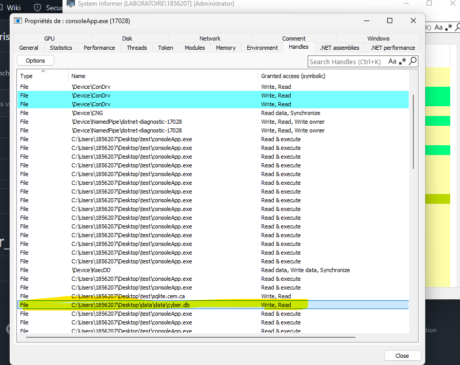
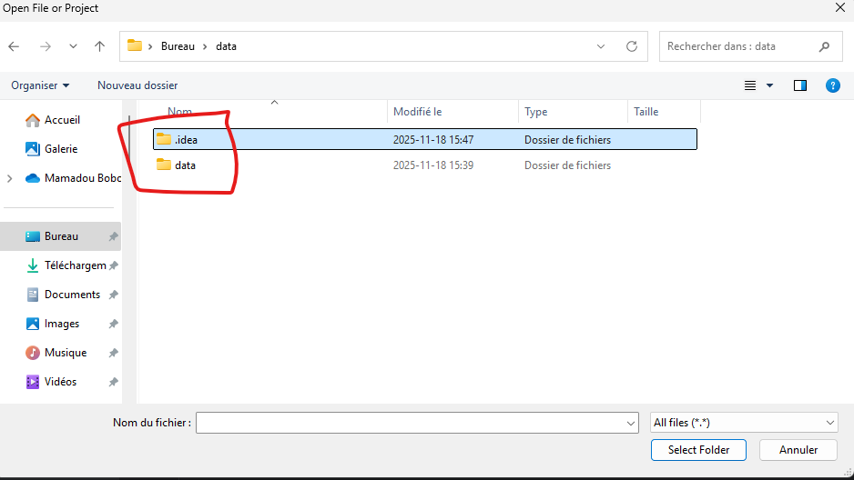
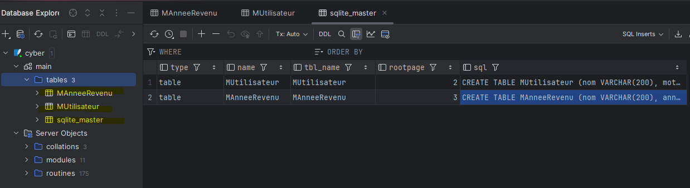
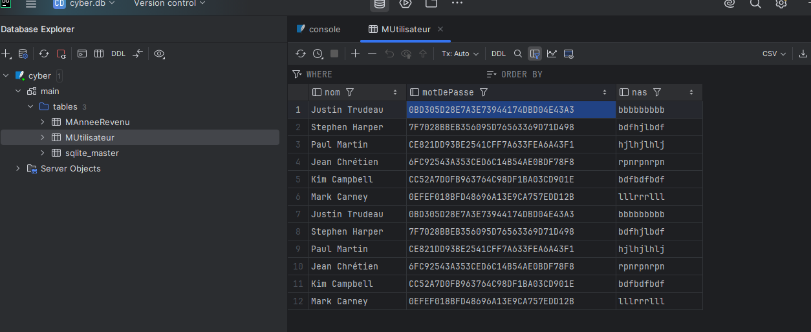
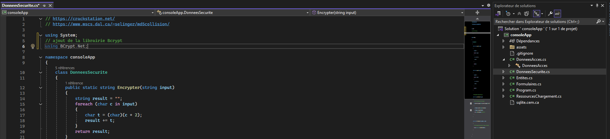
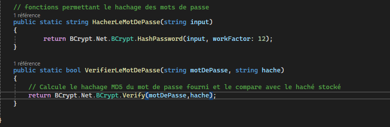
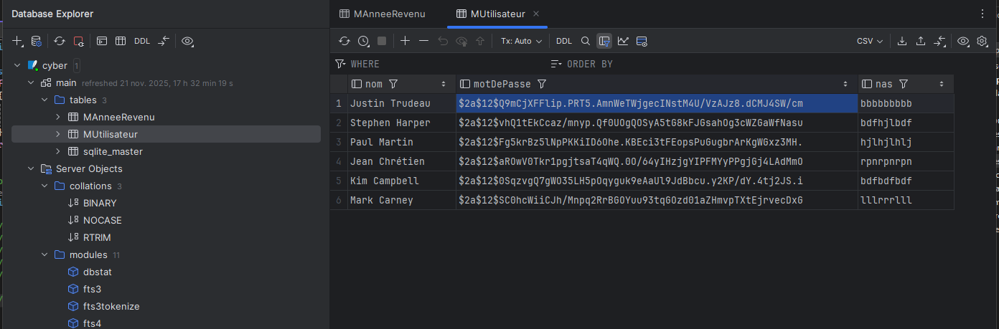
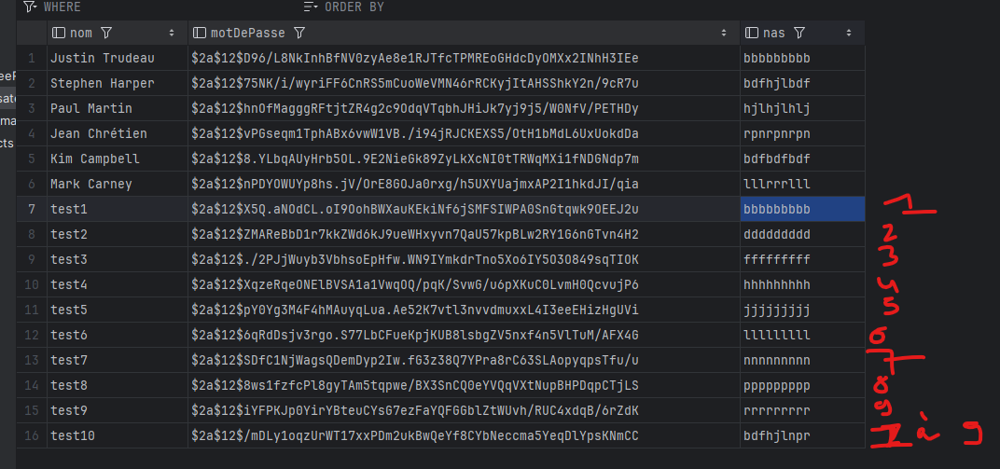
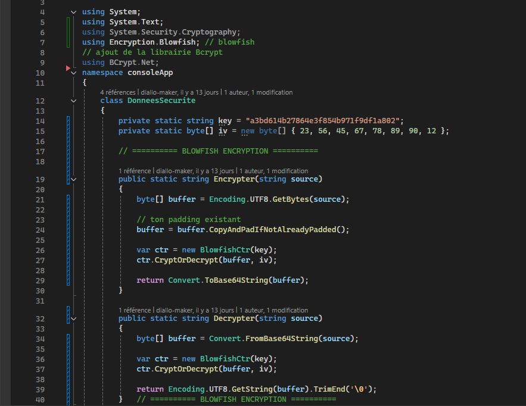
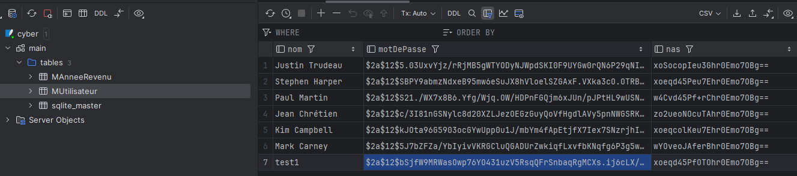

## Début du rapport
# Rapport TP3 de Cybersec Diallo Mamadou Bobo

## Attaque 1: BD fuitée et mot de passe

## Emplacement de la bd (utiliser system informer)

## Ouverture de la bd avec dataGrip

## il ya 3 tables (XML)

## on peut voir les mots de pass (hachs) et les NAS 

### Correctif implanté

On va sécurisé l'apllication avec BCrypt dans visual studio. On ajoute la commande using Bcrypt.Net; pour utiliser la librairie Bcrypt.

 
Dans DonneesSecurite.cs, on modifie le code à l'emplacement fonction permettant le hachage pour cette commande : 

Une fois celà fait, on vérifie le résultat et on constate que les mots de passes dans la base de donnée sont hachés avec Bcrypt.

##
## Attaque 2: BD fuitée et encryption

Dans la base de donnée, les NAS sont chiffrés avec une logique de base qui change chaque lettre de l'aphabet par un chiffre de 0 à 9 et recommence en boucle jusqu'à la lettre Z.
J'ai fait 10 tests avec des utilisateurs différents et un NAS différent de 1 à 9 pour trouver la logique.

### Correctif implanté

Pour le correctif, j'ai encrypté les NAS par encryption symétrique avec blowfish. Cela consiste à cacher les nas présents dans la bd. Donc pour se faire on doit installer le packet Encryption.Blowfish, qui va permettre d'utiliser la librairie blowfish. Ensuite, il faut modifier le code source de l'application et y ajouter using Encryption.Blowfish dans un premier temps en haut du code. Par la suite, il faut remplacer le code présent dans DonneesSecurite.cs dans les methodes Encrypter et Decrypter par les lignes de code suivantes:

##
Une fois fait, on peut constater que dans la base de donnée dans la table MUtilisateur, tous les NAS sont encryptés donc il n'est pas possible de voir les NAS via la bd.

##
## Attaque 3 Injection SQL

1. Etape 1 + copie d'écran
2. Etape 2 + copie d'écran
3. etc.

### Correctif implanté

Description du correctif.

Preuve que l'attaque ne fonctionne plus avec étapes + copie d'écran
